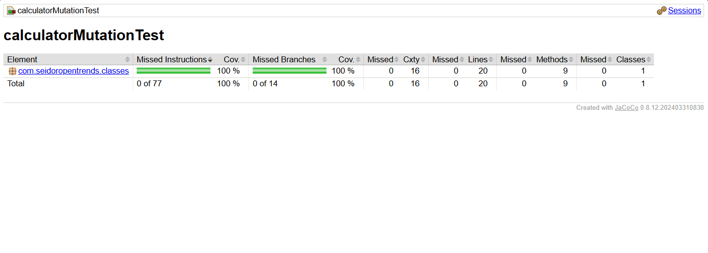

Calculator — Unit & Mutation Testing
Practice of unit testing on the Calculator class using JUnit 4, JaCoCo (coverage), and PIT (mutation testing).

🎯 Objectives

Validate correctness with unit tests following AAA (Arrange–Act–Assert).
Measure coverage (lines and branches) with JaCoCo.
Assess the real strength of the tests with PIT (mutation testing).
Cover normal cases, boundary values, and exceptions.

🛠 Requirements
Java JDK 8+
Maven 3.6+
Tested on Windows/PowerShell (any equivalent terminal works).

📂 Project Structure

calculator-unit_mutation-testing/
├─ src/
│  ├─ main/java/com/seidoropentrends/classes/Calculator.java
│  └─ test/java/mutationTest/CalculatorOperationTest.java
│        (additional tests: CalculatorEdgeCasesTest.java, etc.)
├─ docs/
│  ├─ jacoco_cobertura.png
│  └─ pit_mutation_score.png
├─ pom.xml
└─ README.md

▶️ How to Run

Unit tests
mvn clean test
Coverage report (JaCoCo)
mvn org.jacoco:jacoco-maven-plugin:0.8.12:prepare-agent test org.jacoco:jacoco-maven-plugin:0.8.12:report
Open: target/site/jacoco/index.html
Evidence included: docs/jacoco_cobertura.png
If your environment cannot resolve 0.8.12, use 0.8.11 or 0.8.10.
Mutation testing (PIT)
mvn org.pitest:pitest-maven:mutationCoverage
Open: target/pit-reports/<timestamp>/index.html
Evidence included: docs/pit_mutation_score.png

🧪 Test Scope

All Calculator methods are covered with normal, edge, and error cases:
suma, resta, multiplica
divideix: integer division (truncation), division by 0 → IllegalArgumentException
maxim: a > b, a == b, a < b
arrelQuadrada: positive inputs (with delta), 0.0, negative → IllegalArgumentException
esPositiu: positives / negatives and 0 (contract documented)
potencia: 2^3 = 8, base^0 = 1, 0^0 = 1 (per assignment), negative exponent → IllegalArgumentException, exponent = 1, special bases (1, -1, 0)
Applied criteria
AAA pattern.
Equivalence partitions and boundary values.
Exception verification (and message when applicable).
Reasonable timeout on power operation (basic performance).
JUnit 4 lifecycle: @BeforeClass/@AfterClass, @Before/@After, @Ignore.

# 📈 Results

**JaCoCo Coverage**  

**PIT Mutation Score**  

### (Optional) Before improving tests

> Full HTML reports live in `target/site/jacoco/` and `target/pit-reports/`.

ℹ️ Note on the single “Survived” mutant

PIT reports 1 surviving mutation in Calculator.maxim(int a, int b) (mutator changed conditional boundary on a >= b).
This mutation is equivalent: changing >= to > yields the same observable result when a == b (both values are identical). Equality and b-greater cases are tested, but differentiating these implementations would require changing the API/contract (e.g., exposing which operand was chosen).
Final Mutation Coverage: 96% (25/26).

🔁 Reproduce Evidence

mvn clean test
JaCoCo → command above → open target/site/jacoco/index.html → screenshot → docs/jacoco_cobertura.png
PIT → mvn org.pitest:pitest-maven:mutationCoverage → open latest target/pit-reports/.../index.html → screenshot → docs/pit_mutation_score.png

✅ Quality Notes

Tests are deterministic and isolated (no IO or external deps).
Meaningful line/branch coverage (no empty asserts).
Strong edge-case suite (0, negatives, equality, sign combinations) to kill typical mutants.
Clear, descriptive test names.
